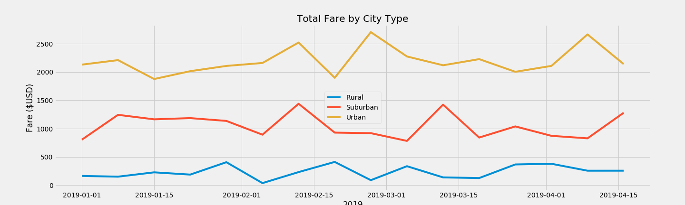
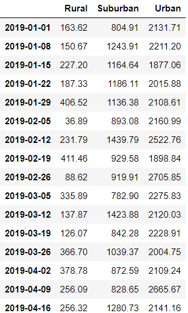

# PyBer_Analysis

The purpose of this analysis was to visually represent how the type of city (Urban, Suburban, or Rural) and the amount of available drivers in the area affect overall revenue for the PyBer ride-sharing service. I analyzed the data using a variety of chart types:  Pie, Scatter, Line, and Box-Whisker. The data from the figures below shows that, without exception, the Urban fares generate the highest gross revenue, the Suburban fares generate the second highest gross revenue, and the Rural fares generate the lowest gross revenue. There are spikes in the Urban fares during February and April, in the Suburban fares during February, March, and April, and the Rural fares have minor spikes throughout the datarange. There does not seem to be any overall pattern in increases or decreases for the different city types, which indicates that the causes for a city type's change in revenue may be specific to that city type. For example, the Urban and Suburban spikes in mid-February may be due to the increase in restaurant patronage on Valentine's Day. There are less restaurants in Rural areas, which could explain why that same spike is not reflected in the Rural data.

I experienced significant challenges and difficulties in performing this analysis. The most memorable challenge was in determining what the data values represented when it came to driver count. It took several filtered dataframes to visually identify that the driver count was the same for each city, meaning that was the driver count for the entire city. I initially thought it was representative of the available drivers at the time of each individual ride, as I assumed the fare would be in some way affected by the number of available drivers at the time. Had I not had a solution image to reference, there would have been no intuitive reason to question the values I received when analyzing the driver count the way I initially did, so the solution is to make sure there is a clear understanding of the values before performing an analysis.

Based on the data from the different city types, I recommend that PyBer's CEO increase the number of drivers in the Rural and Suburban areas and reduce the average fee per ride. The bubble plot performed early on in the analysis showed that the Urban areas had a higher number of total drivers and lower fares, making their services more accessible physically and financially. The counter-argument to this advice is that there are likely more requests in Urban areas, which justifies the higher driver count. To address this counter-argument, I think it would be pertinent to gather data for the number of requests in each area, including requests that were cancelled by the client due to the fare, requests that were cancelled by the client due to the wait time, and requests that were cancelled by PyBer due to a complete lack of available drivers. The reason for the client cancelling is usually available via a cancellation survey issued by the ride-sharing app. If PyBer does not have a cancellation survey implemented already, I would recommend that they create one to assist with building a more thorough recommendation.
